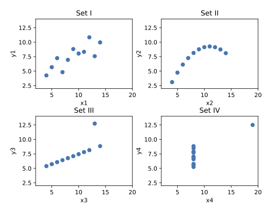
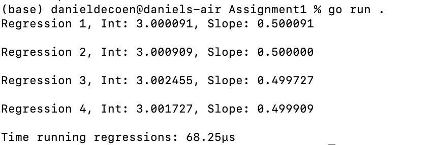
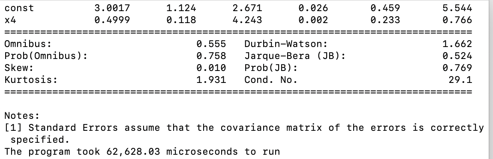

# Assignment 1: Testing Go for Statistics

### The Anscombe Quartet
### Go testing package
### Go statistical package
### https://github.com/montanaflynn/stats

## What does this code do? 
1. Uses Go to analyze the four separate Anscombe Quartet datasets
2. Calculates the slope and intercept needed to peform Ordinary Least Squares Regression
3. Prints out the Regression Results

## Can Go be used for statistics in a similar fashion to Python and R
The answer is yes it can, but it may still be better to perform higher level analysis in Python or R. After completing the assignment, it made me realize that a data scientist/data engineer really needs to be multi-lingual. There are still some data analysis related projects, in particular Exploratory Data Analysis where Python and R are still much stronger than Go. That could be because I am stronger in Python and R than I am in Go, but regardless of the reason, it makes sense to be proficient in more than one lanuage. It is all about having the right tool in the toolbox for whatever problem could arise in the future.

While Go is very fast, the actual coding took much longer as compared to Python or R.   
For example, Python has an extensive library that has several built in commands to use with basic statistics such as Linear Regression.  
When attempting to investigate Anscombe's Quartet in Golang, it was necessary to create several functions to use in conjunction with the stats package.  

Python's statsmodels.api had a built in model for Ordinary Least Squares ("OLS"). It was easy to just run the model in Python as well as print the results.   
Leveraging matplotlib.pyplot also allowed for friendly data visualizations. R is even better with visualizations. This is an area for Golang to continue to improve upon.  

Here is a figure of the Quartet.  

While the Go code does not do any of the data visualization, it does calculate the intercepts and slopes for each of the Anscombe Quartet's data regressions. See the each result below:

The Go code performs much more quickly (e.g., super fast) compared to Python. When running the providing Python code (using the time package) it takes exponentially longer than Go. See results from Python below:

### The Python code made use of demonstration data from
#### Anscombe, F. J. 1973, February. Graphs in statistical analysis. 
####  The American Statistician 27: 17–21.
